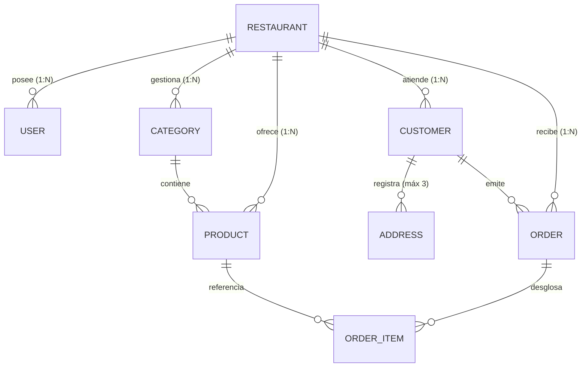

# 🏢 Arquitectura SaaS Multi-Tenant (B2B Gastronómico)

> **Documento de Diseño Técnico y Arquitectura de Datos**  
> **Versión:** 2.0 (Multi-Tenant Evolution)  
> **Audiencia:** Equipo de Ingeniería, Desarrolladores y DevOps

---

## 🧭 1. Visión y Modelo del Negocio

El sistema evoluciona desde un modelo mono-tienda hacia una plataforma **SaaS Multi-Tenant B2B** (estilo **OlaClick / Fu-do / Toast**), diseñada para permitir que múltiples locales gastronómicos, pizzerías y cadenas de comida rápida operen sus negocios de forma completamente autónoma, aislada y personalizada bajo una infraestructura tecnológica centralizada.

```
                            [ DOMINIO CENTRAL ]
                                     │
      ┌──────────────────────────────┼──────────────────────────────┐
      ▼                              ▼                              ▼
  LANDING PÚBLICA               SUPERADMIN                    TENANTS (B2B)
  (/)                           (/superadmin)                 (/[slug])
  • Venta del software          • Altas de restaurantes       • SAS Burger (/sas-burger)
  • Planes y precios            • Suscripciones / MRR         • Pizza Nostra (/pizza-nostra)
  • Captación de leads          • Métricas globales           • Taco Loco (/taco-loco)
```

---

## 🗺️ 2. Estructura de Enrutamiento y Dominios

Aprovechando las capacidades de enrutamiento dinámico de **Next.js App Router**, el árbol de navegación se organiza en cuatro zonas lógicas:

### A. Dominio Raíz — Portal Comercial (`/`)
* **Propósito:** Landing page institucional del SaaS dirigida a dueños de restaurantes.
* **Componentes:** Propuesta de valor, demostración interactiva, calculadora de comisiones, planes de suscripción, testimonios y formulario de registro de nuevos locales.

### B. Portal de Acceso Unificado (`/login`)
* **Propósito:** Punto único de autenticación para todos los perfiles de la plataforma.
* **Flujo de Redirección según Rol:**
  * `SUPERADMIN` ➔ Redirección inmediata a `/superadmin`.
  * `STORE_ADMIN` ➔ Redirección al panel local de su tienda: `/[slug]/admin`.
  * `KITCHEN` ➔ Redirección al monitor de cocina de su local: `/[slug]/kds`.

### C. Consola Maestra — Superadministrador (`/superadmin`)
* **Propósito:** Panel operativo exclusivo de los administradores y dueños del SaaS.
* **Módulos:**
  1. **Gestión de Restaurantes:** Creación, activación, suspensión y configuración de inquilinos (`slug`, razón social, RUT, WhatsApp).
  2. **Gestión de Cuentas de Acceso:** Creación de usuarios administradores locales y personal de cocina.
  3. **Métricas de Plataforma:** MRR, volumen transaccional consolidado, volumen de pedidos por tienda y estado de conexiones activas.

### D. Espacio Aislado del Restaurante (`/[slug]`)
Cada local gastronómico cuenta con su propio sub-espacio dinámico identificado por su `slug`:

| Ruta | Audiencia | Funcionalidad |
|---|---|---|
| `/[slug]` | Comensales | Menú digital categorizado, fotos, precios, notas de cocina y carrito. |
| `/[slug]/checkout` | Comensales | Checkout express sin registro, validación de RUT, cálculo de delivery y generación de pedido vía WhatsApp. |
| `/[slug]/kds` | Cocineros | Kitchen Display System en tiempo real (Kanban: *Por Iniciar*, *En Plancha*, *Listos*), alertas sonoras y comanda térmica de 80mm. |
| `/[slug]/admin` | Dueño del Local | Panel interno del local: control de catálogo, activación/agotado de productos, métricas de ventas y comisiones. |

---

## 🔒 3. Estrategia de Aislamiento Multi-Tenant

### Patrón Seleccionado: Base de Datos Compartida con Discriminador (`Tenant Discriminator Column`)

Evaluamos las tres estrategias estándar de aislamiento multi-tenant:
1. *Base de datos separada por tenant:* Máximo aislamiento, pero prohibitivo en costos operativos y complejidad de migraciones para un MVP/B2B temprano.
2. *Esquema separado por tenant (PostgreSQL Schemas):* Difícil sincronización con ORMs como Prisma.
3. **Base de datos y esquema compartido con columna discriminadora `restaurant_id` (Seleccionada):**  
   Óptima relación entre eficiencia de recursos, soporte de conexión con *Connection Pooling* (Supabase/PgBouncer) y agilidad de desarrollo.



### Reglas de Aislamiento Estricto:
1. **Identificador Obligatorio:** Toda tabla del dominio del negocio (`categories`, `products`, `customers`, `orders`) contiene la columna `restaurant_id UUID NOT NULL REFERENCES restaurants(id) ON DELETE CASCADE`.
2. **Independencia de Clientes:** La tabla `customers` no es global. Un mismo número de teléfono puede pertenecer a dos clientes de dos restaurantes distintos sin colisión gracias a la restricción compuesta:
   ```sql
   UNIQUE (restaurant_id, phone)
   ```
3. **Aislamiento en Consultas Prisma:** Todas las consultas a nivel de servicio o API deben filtrar obligatoriamente por el `restaurantId` extraído del `slug` o de la sesión del usuario.
4. **Seguridad Row Level Security (RLS) en PostgreSQL:** Las políticas de RLS garantizan que ningún usuario de tienda pueda consultar ni mutar registros con un `restaurant_id` ajeno.

---

## 👥 4. Estrategia de Desarrollo y Trabajo en Equipo (3 Desarrolladores)

Para evitar interferencias y garantizar despliegues incrementales y seguros:

```text
main (Producción Vercel)
  ▲
  │ (Release PR)
develop (Integración y Staging)
  ▲
  ├── feat/multitenant-backend (Dev 3 - DB, Prisma, RLS)
  ├── feat/multitenant-routes (Dev 1 - Rutas dinámicas /[slug])
  └── feat/superadmin-portal (Dev 2 - Panel /superadmin)
```

1. **Instancia Centralizada de Supabase:**  
   Todo el equipo apunta a una misma base de datos de desarrollo/staging en Supabase, utilizando migraciones versionadas en `supabase/migrations/` para mantener esquemas 100% idénticos.
2. **Semilla de Datos Controlada (Seed):**  
   El script de semilla crea restaurantes de prueba (`sas-burger`, `demo-pizza`) con sus respectivos usuarios y productos base, permitiendo a los tres desarrolladores probar flujos cruzados de inmediato.
3. **Flujo de Integración Continua (CI/CD):**  
   - Ramas de características (`feat/*`) abiertas exclusivamente desde `develop`.
   - Ningún cambio entra a `develop` sin pasar chequeo estricto de tipos (`tsc --noEmit`).
   - Los merges a `main` disparan automáticamente el despliegue productivo en Vercel.
